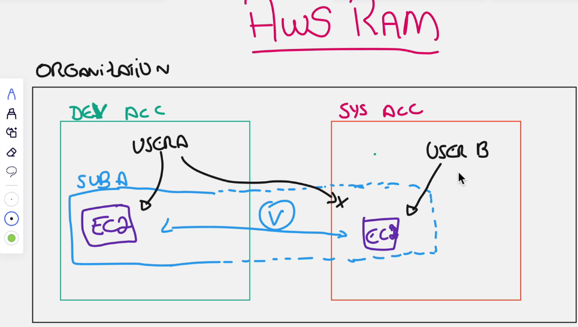

# BILLING AND SUPPORT

### AWS CONTROL TOWER
* É utilizado apenas por grandes empresas.
* O que é? É um processo que simplifica a criação de multiplas contas em ambientes grandes.

### AWS RESOURCE ACCESS MANAGER (RAM)
* Podemos utilizar o RAM para acessar informações de outra conta.
* 

### AWS SERVICE CATALOG
* O AWS Service Catalog é um serviço de gerenciamento de serviços que permite que organizações criem e gerenciem
catálogos de serviços de TI aprovados para uso na AWS.

### AWS TRUSTED ADVISOR
* É um serviço que sabe tudo sobre a AWS, e consegue te mostrar como melhorar:
  * Reduzir custo
  * Melhorar a perfomance
  * Segurança
  * Fault tolerance (Tolerança de quedas)