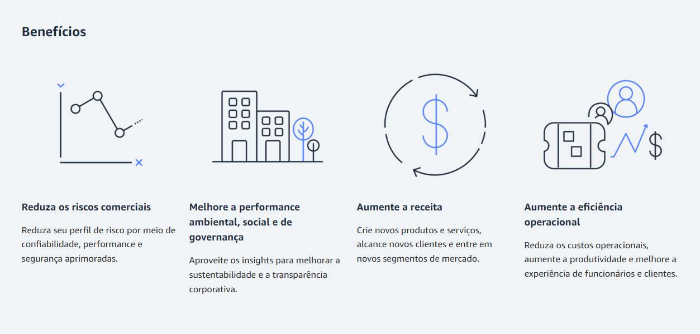
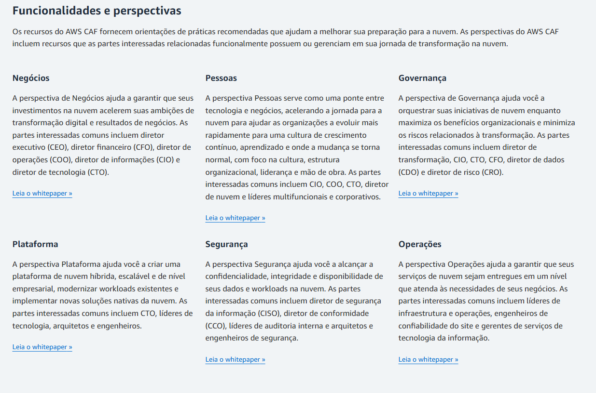
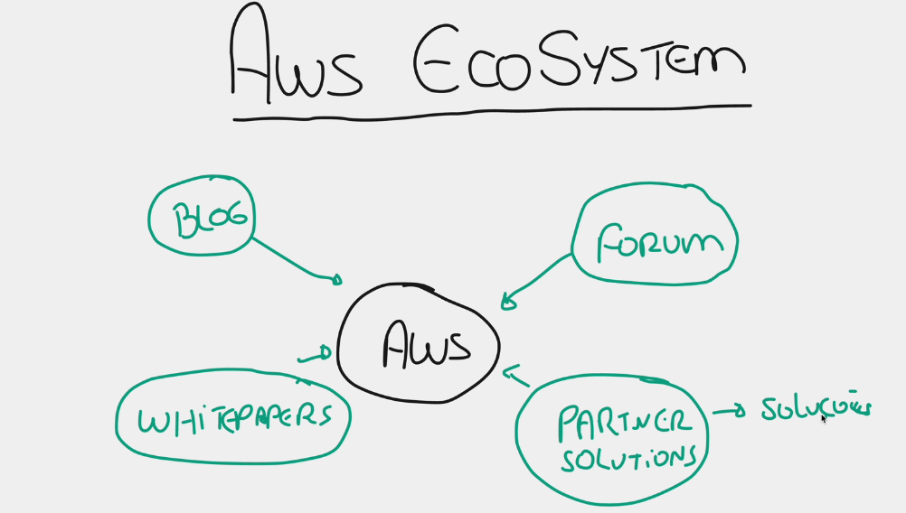

# AWS WELL-ARCHITECTED FRAMEWORK
* É um estrutura criada pela AWS para criar aplicações cade vez mais:
  * Seguras
  * Eficientes
  * Escaláveis

### 1 - Excelencia Operacional
* Você precisa **monitorar** muito bem o seu sistema, para saber o que está funcionando
o que não está funcionando e principalmente o que está **quase** parando de funcionar.

### 2 - Segurança
* Diz que você precisa protejer seus dados, sistemas ou qualquer atividade no seu ambiente cloud.
  * Security Groups
  * ACL
  * AWS KEYMANAGENT SYSTEM
  * AWS IAM

### 3 - Confiabilidade
* É ter certeza que tudo vai está funcionando, até mesmo quando ocorrer uma falha, ou seja, ter redundancia.
  * AZ Diferentes
  * ROUTE53

### 4 - Eficiencia e Perfomance
* Não gastar recursos acima do que é necessario
  * EC2
  * AUTOSCALING
  * ELASTIC CACHE

### 5 - Custos
* Você economizar utilizando recursos otimizados.

### 6 - Sustentabilidade
* Foca em reduzir o impacto ambiental

### AWS CLOUD ADOPTION FRAMEWORK (CAF)
https://aws.amazon.com/pt/cloud-adoption-framework/

### AWS ECOSYSTEM

### AWS IQ
* É utilizado para contratar profissionais especializados.

### AWS MANAGED SERVICES $$$$²
* AWS fica responsável por tudo do seu projeto.