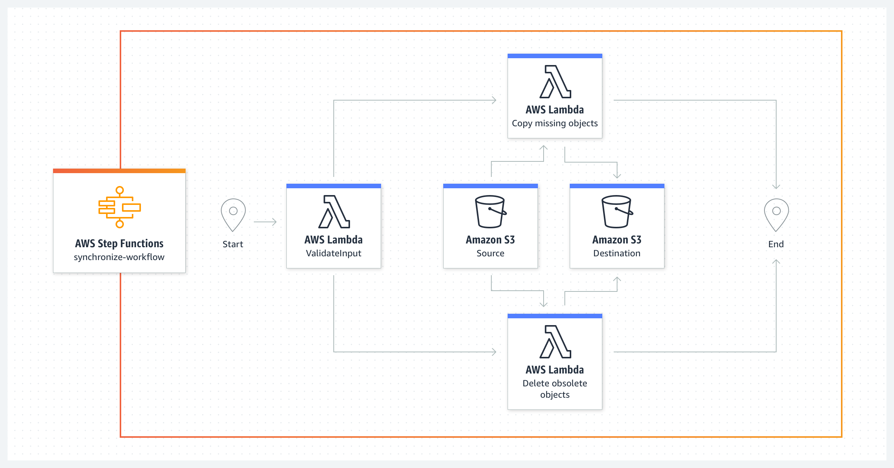

# OUTROS SERVIÇOS

### AWS COGNITO
* É um serviço para utilização de login e sign up dos apps que o cliente possui.
* Ele também possui social identity provider (SIP)

### AMAZON SECURITY TOKEN SERVICE (STS)
* É um serviço para gerar, criar e gerenciar tokens de acesso.

### AWS DEVICE FARM
* É um serviço para developers, ele permite teste em multiplos devices, sejam eles browsers, apps e etc.

### AWS APPSYNC
* É um serviço para se utilizar quando temos um serviço na WEB e no Mobile, o que esse serviço faz é sicronizar
os apps, quando acontece alguma alteração em um dos dois serviços.

### AWS AMPLIFY
* É um serviço para construir aplicações mobile.

### AWS IOT Core
* É um serviço utilizado para conectar devices a cloud, ex: telefone, geladeira, televisão e etc.

### AWS Step Functions
* É um serviço para ordenar funcões que devem seguir uma sequencia.

### AWS AppFlow
* É serviço para fazer a integração de dados entre serviço externos para dentro da cloud da AWS.

### AWS Backup
* O Amazon AWS Backup é um serviço centralizado para fazer backup e restaurar dados em toda a AWS. Com o AWS Backup,
os usuários podem configurar políticas de backup de acordo com seus requisitos de negócios e garantir a conformidade 
regulatória e de políticas.

### AWS Disaster Recovery Strategy
* O AWS Disaster Recovery (DR) refere-se ao conjunto de estratégias e procedimentos implementados na plataforma AWS
para proteger os dados e os sistemas de TI de uma organização contra desastres. Esses desastres podem ser naturais
ou causados pelo homem e podem resultar em perda de dados, interrupção do serviço ou falha do sistema.

### AWS WorkSpaces
* Amazon AWS WorkSpaces é um serviço gerenciado de desktop como serviço (DaaS), que permite provisionar desktops na nuvem
para os usuários acessarem a qualquer hora, de qualquer lugar, usando qualquer dispositivo suportado. Este serviço é uma
solução virtual de substituição de desktop que ajuda a reduzir os custos operacionais e melhorar a segurança dos dados.

### AWS AppStream 2.0
* Amazon AppStream 2.0 é um serviço gerenciado da Amazon Web Services (AWS) que permite o streaming seguro de
aplicativos de desktop para usuários sem reescrever esses aplicativos para a nuvem. Basicamente, o AppStream 2.0
fornece aos usuários acesso instantâneo a aplicativos de desktop por meio de um navegador da web.