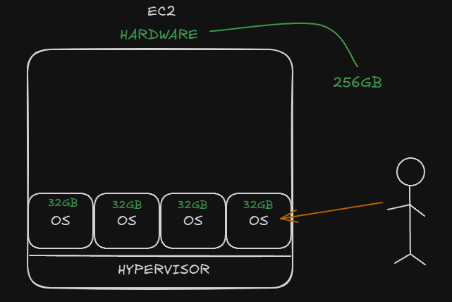
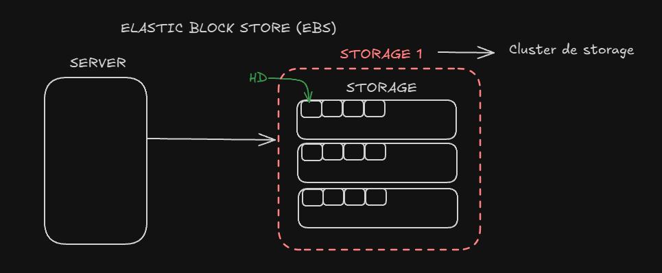

# ELASTIC CLOUD COMPUTER (EC2)

* O EC2 utiliza VM para disponibilizar o que é necessario para o app, dentro dos servidores, temos
varios OS que são distribuidos de acordo com a necessidade do cliente.

* Modelos de aquisição:
  * On demand ($$$$)
    * Você não define em que momento vai utiliza, você apenas cria a sua instancia e começa a utiliza-la.
  * Saving Plans ($)
    * Você faz um contrato com a AWS de 1 a 3 anos, para utiliza aquele serviço e em compensasão o valor
    pago será mais baixo.
  * Spot ($ -> -90%)
    * O spot é utilizado mais para fazer teste, porque a AWS disponibiliza para você um serviço que pode
    ser tomado de você e dado a outro cliente a qualquer momento. O que pode deixar sua aplicação inativa.
    Você paga até 90% menos por uma instancia spot.
  * Host Dedicados ($$$$$$$$$$)
    * Host dedicados são serviços que possuem toda uma estrutura. Utilizados muito por instituições
    financeiras e Governos. É muito caro.
  * Capacidade por demanda ($$$)
    * É utilizado quando você quer aumentar seus serviços em um data especifica. Ex: natal no dia 24 até 
    o dia 26.

***
# ARMAZENAMENTO - ELASTIC BLOCK STORE (EBS)

* O Amazon Elastic Block Store (EBS) é um serviço de armazenamento de alto desempenho oferecido pela AWS para uso com
Amazon Elastic Compute Cloud (EC2). Ele foi projetado para aplicativos que exigem armazenamento de baixa latência para
ler e escrever dados em blocos.

* Características principais do EBS:
  * Desempenho de Armazenamento: EBS fornece armazenamento em bloco de alto desempenho que pode ser anexado a uma
  instância EC2. Os volumes EBS são otimizados para cargas de trabalho que exigem operações de E/S de baixa latência,
  como bancos de dados e aplicativos que exigem muita E/S.
  * Durabilidade: O EBS é projetado para durabilidade. Os volumes EBS são automaticamente replicados em sua zona de
  disponibilidade para proteger contra falhas de componentes, proporcionando alta disponibilidade e durabilidade.
  * Tipos de Volume: EBS oferece vários tipos de volume para atender às necessidades de armazenamento e desempenho.
  Isso inclui os volumes SSD-backed para cargas de trabalho transacionais de uso geral (gp2 e gp3) e de alto 
  desempenho (io1 e io2), e os volumes HDD-backed para cargas de trabalho throughput intensivas (st1 e sc1).
  * Backup com Snapshots: O EBS oferece a capacidade de criar snapshots (cópias) dos seus volumes, que são armazenados
  no Amazon S3 para durabilidade. Esses snapshots podem ser usados para criar novos volumes EBS ou para aumentar
  o tamanho do volume.
  * Criptografia: O EBS oferece a opção de criar volumes criptografados e controlar as chaves de criptografia usando 
  o AWS Key Management Service (KMS). Isso ajuda a atender aos requisitos de conformidade e segurança.
  * Integração com a AWS: EBS é profundamente integrado com outros serviços da AWS, como Amazon CloudWatch para 
  monitoramento, AWS Identity and Access Management (IAM) para controle de acesso, e AWS Snapshot Scheduler 
  para automação de backup.

Em resumo, o Amazon EBS é uma solução de armazenamento em bloco de alto desempenho que é fundamental para muitas 
aplicações em execução na AWS devido à sua durabilidade, flexibilidade e integração com a AWS.

### VALORES E TIPOS DE EBS

* Temos: 
  * HDD: +LENTO  +ESPAÇO ($)
    * Usamos para Backup
  * SDD: +RAPIDO -ESPAÇO ($$$)
    * Usamos para SQL

### SNAPSHOTS

### AMAZON MACHINE IMAGE (AMI)

### ELASTIC FILE SYSTEM (EFS)
* O EFS funciona da mesma forma que o EBS, mas ele possui uma diferença, podemos compartilha esses dados entre AZ/Servidores.
* O EFS custa muito mais caro que o EBS.

### FILE SYSTEM X (FSx)
* O FSx funciona da mesma forma que o EFS, só que para Windows ou outros OS de alta perfomace.
* Ele fica acessivel através do protocolo Server Message Block (SMB).