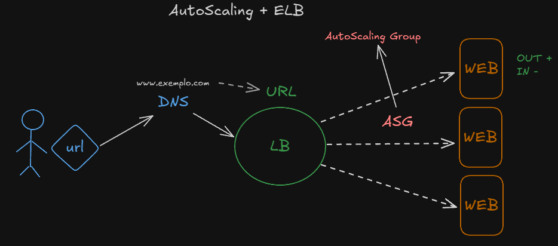

# Escalabilidade, Elasticidade e Disponibilidade

***

### AUTOSCALING

* Autoscaling é responsavel por toda parte de escalabilidade, elasticidade e disponibilidade. Porque ele 
é reponsavel por fazer todas as modificações no seu servidor de forma automatica, de acordo com o que 
você configurou.

### ELASTIC LOAD BALANCER (ELB)
* Utilizado junto com AutoScaling para definir em qual server a requisição será redirecionada.

