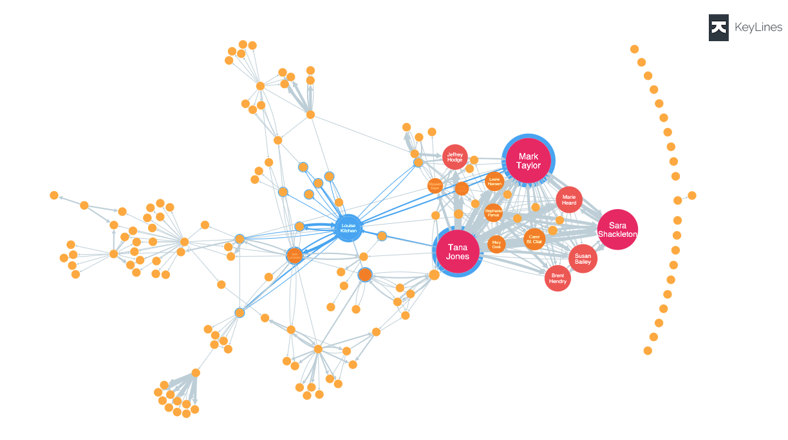

# BANCOS DE DADOS

### RELATIONAL DATABASE (RDS)
* Banco de dados que utilizam SQL.

### NON-RELATIONAL DATABASE
* Banco de dados que não são SQL.
* Serverless

### ELASTICACHE
* Amazon ElastiCache is a fully managed, in-memory data store and cache service provided by Amazon Web Services (AWS).
It's designed to improve the performance of web applications by caching frequently accessed data in memory, which is 
significantly faster than accessing data from traditional disk-based databases. As: REDIS and MEMCACHE

### Amazon Neptune
- Amazon Neptune is a managed **graph** database service provided by Amazon Web Services (AWS). It's designed to store and
  query billions of relationships with low latency. Neptune supports both property graphs (using Gremlin) and Resource
  Description Framework (RDF) data (using SPARQL). It's used in various applications like knowledge graphs,
  fraud detection, and recommendation engines.

### AWS GLUE
- O AWS Glue é reponsável por extrair, transformar e carregar dados. É utilizado principalmente para analises.