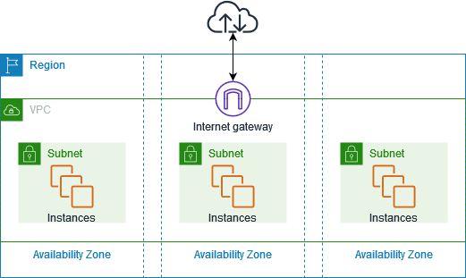

# REDES

### VIRTUAL PRIVATE CLOUD (VPC)
* O Amazon Virtual Private Cloud (Amazon VPC) oferece controle total sobre seu ambiente de redes virtual, incluindo 
posicionamento de recursos, conectividade e segurança.

### NETWORK ACCESS LIST (NACL)
* A Network Access Control List (NACL) in AWS is an optional, subnet-level firewall that controls inbound and outbound 
traffic within your VPC.

### VPC Peering
* O VPC peering é utilizado para permitir a comunicação entre dois VPC. Digamos que temos o VPC para web e um VPC para 
Banco de dados, para fazermos a comunicação entre eles utilizamos o VPC Peering.

### VPC Endpoints
* Quando queremos acessar algum serviço sem expor nossa VPC para internet, utilizamos os endpoints. Temos dois tipos:
  * Gateway utilizado para: S3, DynamoDB
  * Interface utilizado para: Outros serviços.

### VPC FLOW LOGS
* Utilizada para verificar as informações que estão sendo enviadas para a minha instancia. 

### VIRTUAL PRIVATE NETWORK (VPN)
* Utilizado para fazer a conexão entre o usuário e os serviços da AWS, para o usuário que está fora do escopo da AWS.

### AWS PRIVATE LINK
* É utilizado para compartilhar serviços entre contas da AWS, mas com a vantagem de ser escalavel.
  * Com o private link podemos distribuir nosso serviço para varias contas ao mesmo tempo.

### DIRECT CONNECT
* É utilizado para fazer o acesso direto a AWS atráves de um `Link dedicado`.

### AWS TRANSIT GATEWAY (AWS TG)
* É responsável por conectar todas as `VPC`, disponibilizando a visualização entre elas mais facil, e tambêm permite 
conexão com on-premise via `SITE-TO-SITE VPN` e `DIRECT CONNECT`