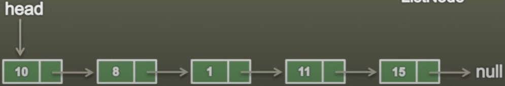

# LINKED LIST

## 1. Singly Linked List is a data structure used for storing collection of nodes and has following properites:

- It contains a sequence of nodes.
- A node has data and reference to next node in a list.
- 
- First node is the **head** node.
- Last **node** has data and points to **null**.
- 

## 2. Implementation of a ListNode is Singly Linked List:

    //Generic Type
    public class ListNode<T> {
        private T data;
        private ListNode<T> next;
    }

    //Integer Type
    public class ListNode {
        private Integer data;
        private ListNode next;
    }

