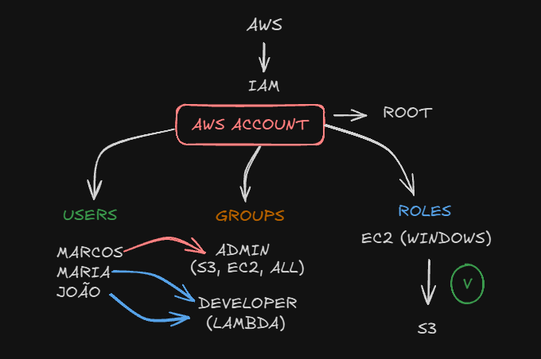
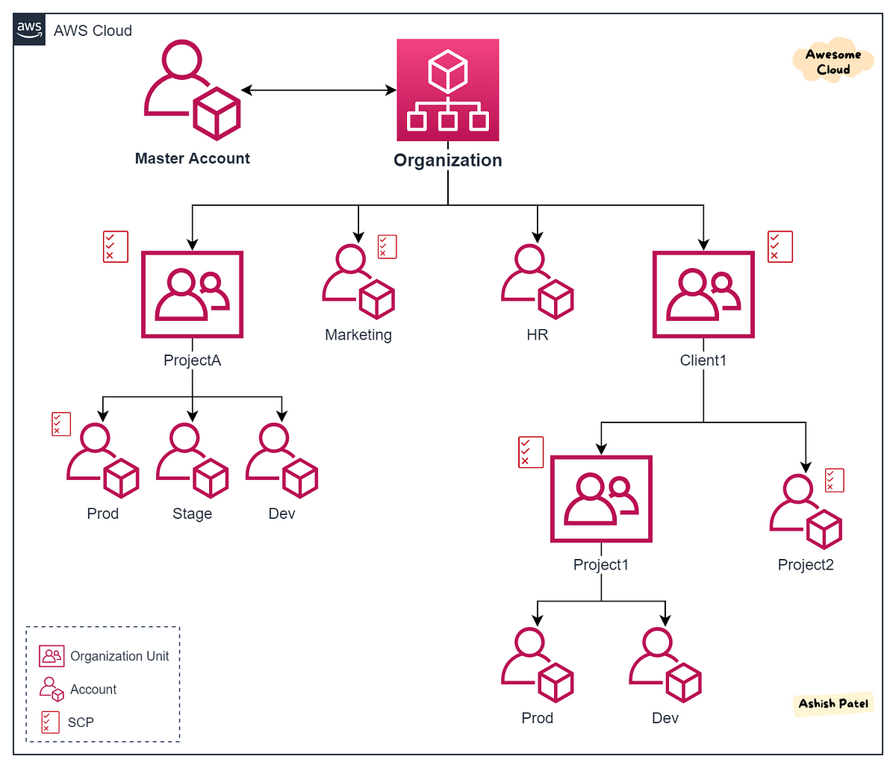

### IAM (IDENTITY ACCESS MANAGEMENT)

* IAM server para organizar os usuários da aws

* Temos os users, que são os usuarios e para esses users temos alguns grupos que servem
para definir o que cada um pode acessar.
* Diferente dos usuarios, para serviços como EC2 temos as roles que definem o que podemos acessar.

* Junto com IAM temos também o IDENTITY CENTER que funciona da mesma forma do IAM, só que ele 
também permite você conectar todas as suas contas da empresa. Ex: Email, Computador, Software.

* MFA (Multi-factor autenticator) é utilizado para adicionar uma camada a mais de segurança na sua conta.

***
### ORGANIZATIONS
