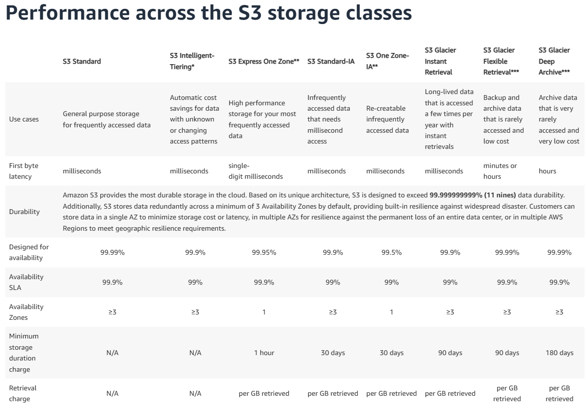

# SIMPLE STORAGE SERVICE (S3)

* É um serviço com armazenamento ilimitado, para fotos, videos, documentos e etc.
* Criamos 'Buckets' para guardar esses nossos dados.

***
### S3 BUCKET

* ``S3 STANDARD``
  * Utilizado para armazenamento padrão que é acessado frequentemente.
  * AZ >3
* ``S3 Intelligent Tiering*``
  * Salvamento de custo automatico para dados com padrão de acesso desconhecidos.
  * AZ >3
* ``S3 Express One Zone**``
  * Grande perfomance para acesso de dados frenquente.
  * AZ =1
* ``S3 Standard-IA``
  * Para acessar dados que são acessados infrequentemente, mas necessitam acesso em millisegundos.
  * AZ >3
* ``S3 One Zone-IA``
  * Utilizado para Recriar dados que não são acessados frequentemente.
  * AZ =1
* ``S3 Glacier Instant Retrieval``
  * Utilizado para guardar dados que são acessados poucas vezes por ano, mas necessitam acesso rapido.
  * AZ >3
* ``S3 Glacier Flexible Retrieval***``
  * Utilizado para guardar backups e dados de arquivos que são raramente acessados.
  * AZ >3
* ``S3 Glacier Deep Archive***``
  * Utilizado para guardar arquivos que são raramente acessos e possui um baixo valor.
  * AZ >3

***
### S3 STATIC WEBSITE
* É um site que não tem formulario, não tem acão. 

### VERSIONAMENTO
