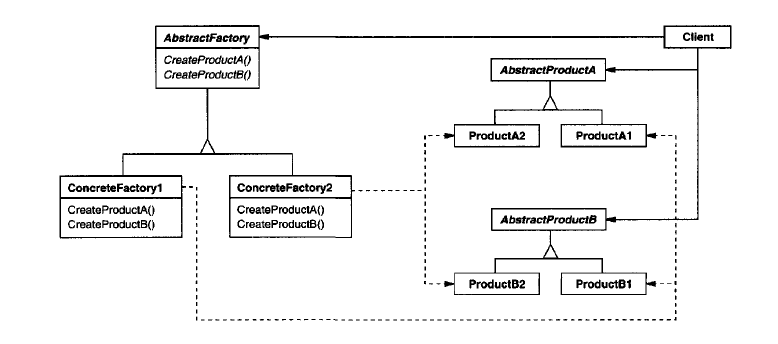

# Intent

### Provide an interface for creating families of related or dependent objects without specifying their concrete classes.

# Also known as _"kit"_

# Applicability

Use the Abstract Factory pattern when
-   
-   A system should be independent of how it's products are created, composed, and represented
-   A system should be configured with one of multiple families of products.
-   A family of related products objects is designed to be used together, and you need to enforce this constraint.
- You want to provide a class library of products, and you want to reveal just their interfaces, not their implementations.

# Structure

Consequences
-
1. It isolates concrete classes. The Abstract Factory pattern helps you control the
    classes of objec ts that an application creates. Because a factory encapsulates
    the responsibility and the process of creatin g product obje cts, it isolates clients
    from implementation classes. Clients manipulate instances through their
    abstract interface s. Product class names are isolated in the implementation
    of the concrete factor y; they do not appear in client code.
2. It makes exchanging product families easy. The class of a concrete factory appears
   only once in an application—that is, where it's instantiated. This makes it
   easy to change the concrete factory an application uses. It can use different
   product configurations simply by changing the concrete factory. Because an
   abstract factory creates a complete family of products, the whole product
   family changes at once. In our user interface example, we can switch from
   Motif widgets to Presentation Manager widgets simply by switching the
   corresponding factory objects and recreating the interface.
3. It promotes consistency among products. When product objects in a family are designed towork together, it's important 
   that an application use objects from only one family at a time. AbstractFactory makes this easy to enforce.
4. Supporting new kinds of products is difficult. Extending abstract factories to
   produce new kinds of Products isn't e asy.Tha t's because theAbstractFactory
   interface fixes the set of products that can be created.Supporting new kinds of
   products requires extending the factory interface, which involves changing
   the AbstractFactory class and all of its subclasses. We discuss one solution to
   this problem in the Implementation section.