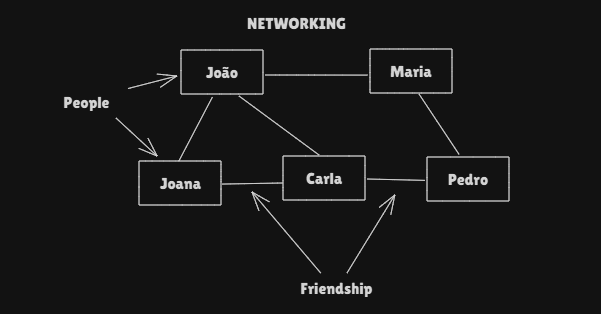
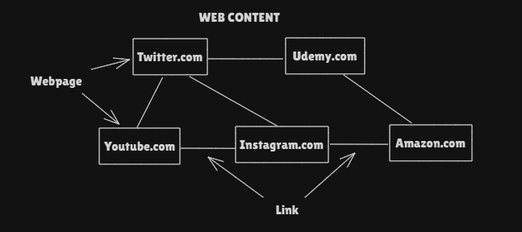
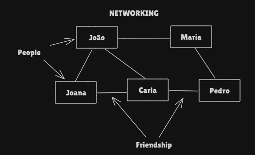
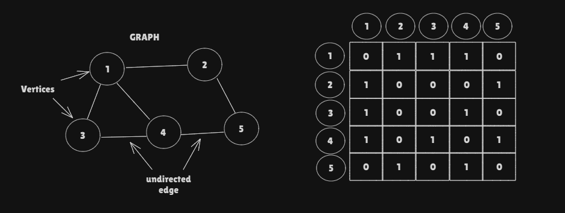
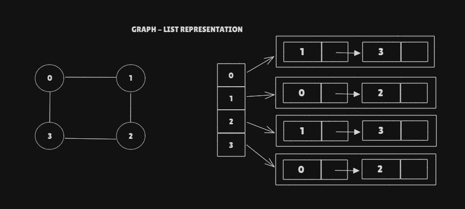

# GPAPHS

### WHAT IS A GRAPH?
* It's a non-linear data structure used for storing data.
* It's a set of __vertices__ and a collection of __edges__ that connects a pair
of vertices
* In below example 1,2,3,4,5 are the __Vertex__ of Graph and each line connecting
them is called as __edge__

***

### SOCIAL NETWORKING

* Graphs help us implement Social Networking sites such as, Facebook, Twitter etc.
It can be called as Social Networking graphMatrix.
* Names of people represent vertices of Graph.
* Friendship between two people can be represented as an Edge of Graph.

***

### WEB CONTENT OVER THE INTERNET

* Graph help us organize Web content over the Internet
* Webpages such as google.com, udemy.com etc represent vertices of Graph.
* A link between two webpages can be represented as an Edge of Graph.

***

### UNDIRECTED GRAPH

* Example: Social Networking Graph is an undirected graphMatrix
  * If Joana is friend of João, so João is friend of Joana.

* We can represent undirected graphMatrix as Adjacent Matrix[][] with values 0 and 1.
  * The value 1 represents if exist connection between the vertices
  * The value 0 represents that doesn't exist connection between the vertices.

* We can also represent undirected graphMatrix as an Array of Linked List.
  * Where the array position will contain the value, and the values inside of this position
  will be a Linked List of vertices that are connected to the value.
